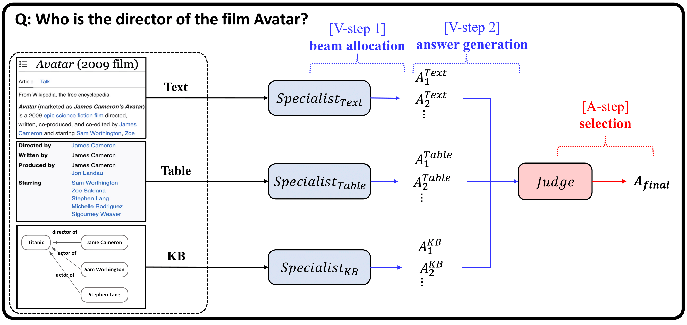

# Judge-Specialist Framework for QA
Repository for the paper "On Monotonic Aggregation for Open-domain QA", presenting a new approach to improve accuracy and robustness in multi-source QA, especially when handling noise from speech recognition.

[Paper Link](https://arxiv.org/abs/2308.04176)

## Overview of Judge-Specialist Framework
<p align="center">
  
</p>

## Dataset Access
Access the datasets used in our research via [link](https://arxiv.org/abs/2308.04176)


## Model Checkpoint Access
Access the trained models of our Judge-Specialist Framework via [link](https://arxiv.org/abs/2308.04176)

## Code
We're refining our code and will upload it soon.

## License
Our framework is for non-commercial use only. For potential violations, contact us.

## Citation
Cite our paper if you find it useful:
```
@article{han2023monotonic,
  title={On Monotonic Aggregation for Open-domain QA},
  author={Han, Sang-eun and Jeong, Yeonseok and Hwang, Seung-won and Lee, Kyungjae},
  journal={arXiv preprint arXiv:2308.04176},
  year={2023}
}
```

## Contact
For any questions about the implementation or content of the paper, you could contact me via the following email:
```
jys3136@snu.ac.kr
```
